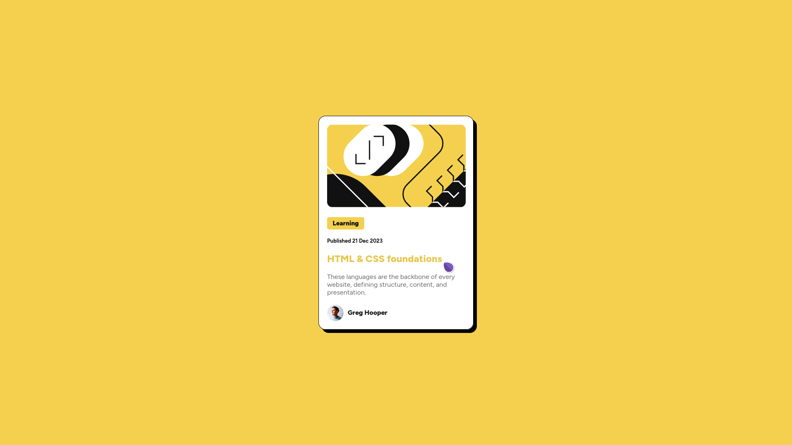

# Frontend Mentor - Blog preview card solution

This is a solution to the [Blog preview card challenge on Frontend Mentor](https://www.frontendmentor.io/challenges/blog-preview-card-ckPaj01IcS). Frontend Mentor challenges help you improve your coding skills by building realistic projects. 

## Table of contents

- [Overview](#overview)
  - [The challenge](#the-challenge)
  - [Screenshot](#screenshot)
  - [Links](#links)
- [My process](#my-process)
  - [Built with](#built-with)
  - [What I learned](#what-i-learned)
  - [Continued development](#continued-development)
- [Author](#author)
- [Acknowledgments](#acknowledgments)

## Overview

### The challenge

Users should be able to:

- See hover and focus states for all interactive elements on the page

### Screenshot



### Links

- Live Site URL: [view](https://agentsquareofficial.github.io/blog-preview-card-main)

## My process

### Built with

- Semantic HTML5 markup
- CSS custom properties
- Flexbox
- Mobile-first workflow
- [Styled Components](https://styled-components.com/) - For styles

### What I learned

Ok so this time, I learned a lot about flexbox, and how to use them effectively. Also the margin and padding use in the project is increasing, with extreme care to be taken there. From next onwards, I will focus on these areas frequently.

To see how you can add code snippets, see below:

```html
<h1>Some HTML code I'm proud of</h1>
<div class="text">
  <div class="small">
    <h3><b>Learning</b></h3>
  </div>
  <h4>Published 21 Dec 2023</h4>
  <h2>HTML & CSS foundations</h2>
  <p>These languages are the backbone of every website, defining structure, content, and presentation.</p>
  <div class="pip">
    
    <h3>Greg Hooper</h3>
  </div>
</div>
```
```css
.proud-of-this-css{
    background-color: hsl(47, 88%, 63%);
    width: 90px;
    text-align: center;
    font-size: small;
    border-radius: 5px;
    margin-bottom: 20px;
    line-height: 30px;
}
```

### Continued development

I will try to focus on the alignment area, if anybody suggest some tips and tricks, it would be very usefull.

## Author

- Frontend Mentor - [@agentsquare](https://www.frontendmentor.io/profile/agentsquareofficial)

## Acknowledgments

This project was pretty easy, completely done by me.
